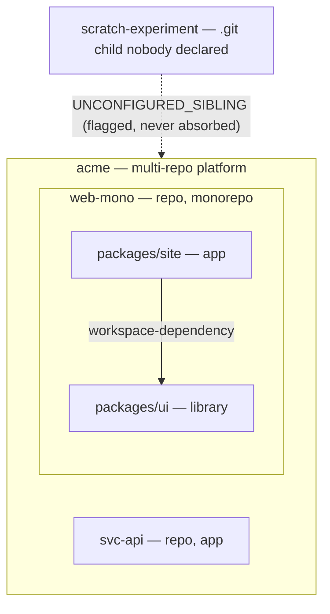

# @spec-engine/platform-map

A small, zero-runtime-dependency TypeScript library and CLI that answers one
question deterministically: **"What is this platform made of?"**

Point it at a directory and it produces a topology map of the repos and
packages found there: the **units** (repos and workspace packages), the
**edges** between them (workspace dependencies), and **diagnostics** for
everything it could not resolve. The same tree always produces byte-identical
JSON, so developers, CI jobs, and code agents working across many repos can
share one map instead of re-deriving their own.

It handles four shapes, and mixes of them:

| Shape | Example | How it is recognized |
|---|---|---|
| Single repo | one `package.json` | nothing else found |
| Monorepo | pnpm / yarn / npm workspaces, lerna | a workspace manifest |
| Multi-repo platform | several sibling git repos | a checked-in `platform-map.json`, or sibling `.git` dirs |
| Multi-repo of monorepos | sibling repos, some of them monorepos | recursion: any repo unit that is a monorepo gets its packages expanded |

Design principles and known gaps:
[PRINCIPLES.md](https://github.com/spec-engine/platform-map/blob/main/PRINCIPLES.md).
Architecture:
[docs/architecture.md](https://github.com/spec-engine/platform-map/blob/main/docs/architecture.md).

## Install

```bash
npm install @spec-engine/platform-map
```

Zero runtime dependencies. Requires Node `>=20` or Bun. Ships ESM and
CommonJS builds with matching type declarations.

## Example

Three unrelated repos (a plain service, a whole monorepo, and a stray
experiment) become one map:



[docs/demo.html](https://github.com/spec-engine/platform-map/blob/main/docs/demo.html)
shows directory trees next to the maps the CLI produced from them, one plate
per shape. To rebuild locally from a clone:

```bash
npm run demo                            # builds fixtures, runs the CLI, 28 checked assertions
node scripts/demo-platform.mjs --keep   # same, but leaves the trees on disk to explore
```

## CLI

```
platform-map [dir]            print the topology tree (default)
platform-map --json [dir]     print the deterministic PlatformMap JSON
platform-map detect [dir]     print the raw detect() classification (JSON)
platform-map graph [dir]      print the dependency graph (JSON, or --dot)
platform-map init [dir]       write a proposed platform-map.json

--json            emit JSON instead of the human tree
--dot             emit Graphviz DOT (graph only)
--yes, -y         skip the confirmation prompt (init only)
--boundary <dir>  containment boundary for upward platform resolution
                  (default: the home directory)
--help, -h        show help and exit 0
--version, -V     print the version and exit 0
```

`dir` defaults to the current directory. In tree mode diagnostics go to
stderr; in `--json` mode they are embedded in the output and stderr stays
empty, so `platform-map --json | jq` is safe.

Exit codes:

| Code | Meaning |
|---|---|
| 0 | mapped; no error-severity diagnostics |
| 1 | usage error, nonexistent directory, or malformed `platform-map.json` |
| 2 | mapped, but at least one `error`-severity diagnostic is present |

The library core never writes. `init` is the one writer, and it always
confirms first unless `--yes` is passed.

## Library

```js
// ESM
import { map, detect, graph, deriveRole, toJSON } from "@spec-engine/platform-map";
// CommonJS
const { map, detect, graph, deriveRole, toJSON } = require("@spec-engine/platform-map");

const pm = await map(".");            // full assembly
console.log(toJSON(pm));              // byte-identical JSON string

const g = graph(pm);                  // pure views over pm.units + pm.edges
g.roots();                            // units nothing depends on
g.leaves();                           // units that depend on nothing
g.dependentsOf("packages/ui");        // "what breaks if I touch this"
g.cycles();                           // [] when acyclic
```

### Functions

| Function | Returns | Notes |
|---|---|---|
| `map(root, opts?)` | `Promise<PlatformMap>` | Resolves the platform root, detects the shape, reads every config source, builds edges, derives roles. Throws only `RootNotFoundError` (the directory does not exist) and `MalformedConfigError` (a present `platform-map.json` fails to parse or validate). Everything else becomes a diagnostic. |
| `detect(root, opts?)` | `Detection` | Cheap synchronous shape probe: `mode`, workspace `flavor` and globs, `orchestrator` overlay (turbo/nx), and candidate `siblings`. No git subprocesses. |
| `graph(pm)` | `PlatformGraph` | `toDepGraph()`, `dependenciesOf(name)`, `dependentsOf(name)`, `roots()`, `leaves()`, `cycles()`. Pure; all results lexically sorted. |
| `deriveRole(signals)` | `Role` | The role classifier, exported so you can recompute or audit a unit's `role` from its `signals`. |
| `toJSON(pm)` / `serialize(pm)` | `string` / `PlatformMap` | The single sort-and-stringify seam. See Determinism. |

### `MapOptions`

| Option | Default | Effect |
|---|---|---|
| `adapters` | all enabled | Disable a config source by name: `{ adapters: { siblings: false } }`. Names: `canonical`, `dark-factory`, `spec-engine`, `workspace`, `siblings`. |
| `units` | none | Inject units directly (`{ name, path, ref? }[]`). They rank just below the canonical config and carry `sources: ["caller"]`. |
| `ignore` | `[]` | Extra ignore globs for child enumeration. |
| `scanRoot` | `".."` | Where the zero-config sibling scan looks, relative to `root`. |
| `boundary` | `os.homedir()` | The directory above which upward platform resolution never ascends. See Run-anywhere resolution. |
| `refProbe` | enabled | Set `false` to skip the git `origin/HEAD` probe; every `ref` is then `null`. The probe is timeout-bounded, so a loaded machine can otherwise yield `null` where a fast one yields a branch name. |

All exported types (`PlatformMap`, `Unit`, `Edge`, `Diagnostic`, `UnitSignals`,
`PlatformGraph`, `Detection`, `MapOptions`, `PlatformMapConfig`,
`PlatformDefinition`, `MemberMarker`, `PlatformLocalConfig`, `AdapterName`,
`Mode`, `Role`) are the public contract. Changing any shape is a
semver-major change.

## The output model

```ts
interface PlatformMap {
  name: string;          // config name, else basename(root)
  root: string;          // the resolved platform root (the given dir unless a definition re-anchors it)
  mode: "single-repo" | "multi-repo" | "monorepo";
  units: Unit[];         // sorted by name
  edges: Edge[];         // sorted by (from, to)
  diagnostics: Diagnostic[];
  schemaVersion: 1;
}

interface Unit {
  name: string;          // platform-relative path, unique within the map
  path: string;          // relative path from the containing unit's root
  kind: "repo" | "workspace-package";
  mode: Mode;            // "monorepo" means units[] is populated
  ref: string | null;    // resolved default branch (repos only)
  units: Unit[];         // recursive children
  signals: UnitSignals;  // observed facts; absent means "not determined"
  role: "library" | "app" | "unknown";
  sources: string[];     // which config sources contributed, in precedence order
}

interface Edge {
  from: string;          // dependent Unit.name
  to: string;            // dependency Unit.name
  via: "workspace-dependency";   // the only edge kind today
}
```

`signals` are facts read from `package.json` and the filesystem: `private`,
`hasExports`, `hasBin`, `hasStartScript`, `packageName`, `hasDockerfile`,
`hasDeployConfig`, `languages`, `packageManager`, `workspaceInDegree`,
`workspaceOutDegree`, plus the integration flags listed under Integrations.
A missing signal is never treated as `false`.

### How `role` is derived

`role` is a derived view, not a stored fact. Rules are evaluated top-down,
first match wins, and an absent signal casts no vote:

1. `hasDockerfile` or `hasDeployConfig` or `hasStartScript` → **app**
2. `workspaceInDegree > 0` (something imports it) → **library**
3. `hasExports === true` and `private !== false` → **library**
4. `workspaceInDegree === 0` and `workspaceOutDegree > 0` and no exports
   (a pure sink) → **app**
5. otherwise → **unknown**

A canonical `overrides[name].role` beats every rule.

## Configuration

Config is optional forever: a directory with no `platform-map.json` still
maps. When present, `platform-map.json` is authoritative and always wins
over anything detected.

### How sources are combined

Sources are folded in fixed precedence, highest first:

1. `canonical` — `platform-map.json`
2. caller-injected `MapOptions.units`
3. `dark-factory` — `.factory/df-config.json` (see Integrations)
4. `spec-engine` — `spec-engine.member.json` (see Integrations)
5. `workspace` — pnpm / yarn / npm / lerna workspace manifests
6. `siblings` — the zero-config sibling `.git` scan

The first writer of a field wins. A lower source that disagrees produces a
`CONFIG_CONFLICT` diagnostic naming both values, never a silent override.
Unconfirmed sibling candidates become `UNCONFIGURED_SIBLING`.

Workspace-manifest detection probes, in order: `pnpm-workspace.yaml` >
yarn workspaces > npm workspaces > `lerna.json`. `turbo.json` / `nx.json` are
recorded as an `orchestrator` overlay only; they never decide the flavor.

### Unit-level config

The shape a single repo or monorepo commits at its own root:

```json
{
  "name": "acme-api",
  "units": [
    { "name": "svc-api", "path": "../acme-service-api", "ref": "main" }
  ],
  "ignore": ["scratch-*"],
  "overrides": {
    "packages/tooling": { "role": "library" }
  }
}
```

All keys are optional. `name` overrides the map name (else the directory's
basename). A non-empty `units` array declares the unit set explicitly, which
turns off sibling promotion: detected siblings not listed here become
`UNCONFIGURED_SIBLING`. `overrides` sets per-unit roles. Unknown top-level
keys are ignored for forward compatibility; known keys are validated
strictly.

### Platform-root convention

Platform membership is declared in checked-in files. Adoption is
progressive:

1. **Single repo** — an in-repo `platform-map.json`, or nothing at all;
   detection works zero-config.
2. **Monorepo** — same file, same repo; workspace manifests supply the
   members.
3. **Multi-repo platform** — a small git repo (the *platform root*) holds the
   checked-in canonical definition; the member repos are its child
   directories (untracked by the platform repo's git). Running `platform-map`
   anywhere in the platform (the root, a member root, or any nested member
   subdir) yields the same map, byte-identical.

One filename, `platform-map.json`, three shapes discriminated by key
presence (checked in this order: `members` wins, then `platform`, else the
unit-level config above).

#### Platform definition

Committed at the platform root. Identity only: the platform name plus the
member list. A member's `path` defaults to its `name` (the child-dir
convention); omit it unless the member lives in a subdirectory:

```json
{
  "name": "acme",
  "members": [
    { "name": "svc-api" },
    { "name": "svc-worker" },
    { "name": "webapp" }
  ],
  "ignore": ["scratch", "archive-*"]
}
```

(`platform`, `root`, `units`, and `overrides` are rejected alongside
`members`: a definition is identity, not configuration.)

#### Member marker

Committed inside each member. Identity plus a root hint, no sibling lists,
no machine paths:

```json
{
  "platform": "acme",
  "root": ".."
}
```

`root` defaults to `".."` and may be omitted. A member with a marker still
maps standalone as a plain repo when its platform root is missing; the
marker adds context, never a hard dependency.

#### Back-compat firewall

A repo whose `platform-map.json` has neither `members` nor `platform`
self-describes exactly as a unit-level config, and the upward platform
resolution deliberately stops at such a repo.

### Per-user disk locations: `platform-map.local.json`

The committed definition carries identity; where members live on your
machine is per-user. By default a member is expected at its conventional
child directory under the platform root. When your checkout lives elsewhere,
add `platform-map.local.json` next to the definition:

```json
{
  "locations": {
    "svc-worker": "../checkouts/svc-worker"
  }
}
```

Values are relative to the platform root (or absolute). **Add
`platform-map.local.json` to the platform repo's `.gitignore`**: it is
per-user machine state and must never be committed. An override changes only
where the member is *read* from disk: the unit's `path` in output stays the
conventional relative path, output is byte-identical with and without an
equivalent override, and machine paths never appear in output. A malformed
local file degrades to a `MALFORMED_CONFIG` warning; it can never brick the
map.

### Run-anywhere resolution and the boundary

`map()` resolves the platform root before detection: from the given
directory it walks upward, following a member marker's root hint or stopping
at a directory that holds a definition. The walk is bounded: it never
ascends above `MapOptions.boundary` (default `os.homedir()`), and marker
hints or local overrides that physically resolve outside the boundary
(symlinks included) become diagnostics (`UNIT_PATH_ESCAPE`, "escapes
resolution boundary") and are never followed. The boundary governs the
upward walk and marker/override following only: a definition at the invoked
directory itself is always honored, so pointing `map()` (or the CLI)
directly at a platform root gets full platform semantics even at `/tmp`,
`/app`, or a CI workspace outside `$HOME`. From inside a member outside the
boundary, pass `--boundary <dir>` on the CLI (or `MapOptions.boundary`) to
contain the walk there.

Under a definition, member units always carry `sources: ["canonical"]`: a
listed member is a canonically declared identity regardless of physical
presence or local relocation. A listed member missing from disk is still
emitted (with empty signals) plus a `PLATFORM_DRIFT` warning; an unlisted
`.git` child of the platform root surfaces as `UNCONFIGURED_SIBLING`;
membership is always explicit, never guessed.

### Bootstrapping with `init`

`platform-map init` at a manifest-less directory whose children include git
repos proposes the full platform bootstrap:

```bash
$ platform-map init .          # or: init --yes to skip the prompt
{
  "platform-map.json": { "name": "acme", "members": [ ... ] },
  "svc-api/platform-map.json": { "platform": "acme", "root": ".." },
  "webapp/platform-map.json": { "platform": "acme", "root": ".." }
}
platform-map: will write 3 files:
  platform-map.json
  svc-api/platform-map.json
  webapp/platform-map.json
Write 3 files? [y/N]
```

The plan (stdout) is one JSON object keyed by root-relative file path; the
listing and prompt go to stderr. `init` never overwrites: if the root
`platform-map.json` exists the whole init refuses; if a member's file exists
that one file is skipped with a note and the rest are still written. It
never writes `platform-map.local.json` and never touches `.gitignore`.

## Diagnostics

Every diagnostic carries a `code`, a `severity` (`info` | `warning` |
`error`), an optional platform-relative `path`, and a human-readable
`message` with a stable prefix per code.

| Code | Meaning |
|------|---------|
| `UNCONFIGURED_SIBLING` | A candidate sibling repo has no config confirming it as a unit. |
| `CONFIG_CONFLICT` | Two sources disagree on a value; precedence was applied and both are reported. |
| `MALFORMED_CONFIG` | A JSON/shape error was found in a source file (integration config or local override, not the canonical file, which throws). |
| `UNMATCHED_PATTERN` | A workspace/ignore glob pattern matched nothing. |
| `CYCLE_SUSPECTED` | The edge graph contains a cycle; mapping still succeeds. |
| `UNIT_PATH_ESCAPE` | A resolved unit path would escape the platform root or boundary; the unit is dropped. |
| `CENSUS_TRUNCATED` | A depth or entry-count cap was hit during the file census. |
| `PLATFORM_DRIFT` | A platform file disagrees with reality: marker platform-name or root-hint mismatch, dangling marker, listed-but-missing member, dangling local override (all warnings), or a non-repo child dir at a platform root (info). Stable message prefix per sub-case. |

## Determinism

`toJSON(pm)` and `serialize(pm)` are the single sort/stringify seam for a
`PlatformMap`: the same logical map always serializes to a byte-identical
JSON string, regardless of the order its `units`, `edges`, or `diagnostics`
arrays were constructed in. Nested `units[]` are sorted recursively by
`name`; `edges` are sorted by `(from, to)`; `diagnostics` are sorted by
`(severity: error > warning > info, then code, then path)`. All comparisons
use plain `<`/`>` on strings, never a locale-aware comparison, so output is
stable across environments and Node versions. Output never contains absolute
filesystem paths or timestamps.

## Security posture

Read-only core (the CLI's `init` is the only writer); no network; no git
mutations; the one subprocess is a timeout-bounded `git` ref probe. Every
resolved unit path is checked against the platform root and the boundary;
symlinks are never followed during walks; file-census scans are
depth- and count-capped and report truncation; package names are validated
before entering the model; `pnpm-workspace.yaml` is parsed with a regex
subset, not a YAML library.

## Integrations

Two optional config sources read files written by other tools. Both are
enabled by default, contribute only linkage facts, and can be turned off
with `MapOptions.adapters`.

### `dark-factory`: `.factory/df-config.json`

Dark Factory is a workflow tool for code
agents that keeps its state under `.factory/`. If `<root>/.factory/df-config.json`
exists, this source reads it:

- A **pointer-only** file (exactly `{ "platform": { "factoryDir": "..." } }`)
  sets `signals.hasDfPointer: true` on the root unit. The pointer is never
  followed.
- A **full** config contributes `platform.repos[]` as `kind: "repo"` units.
  Its other fields, including `dependsOn`, are ignored: no edges are derived
  from it.
- Any other shape sets `signals.dfConfigConflict: true`.
- An unparseable file becomes a `MALFORMED_CONFIG` warning.

Disable with `{ adapters: { "dark-factory": false } }`.

### `spec-engine`: `spec-engine.member.json` and `spec-engine/`

Spec Engine is a requirements-catalog tool
whose members carry a `spec-engine.member.json`. This source reads that file:

- A member file sets `signals.hasSpecEngineConfig: true`.
- A `members` glob in it expands into `<child>/<rel>` sub-units, each
  carrying the same signal. The member file's `ignore` array belongs to Spec
  Engine's own scanner and never filters this expansion; only the
  caller-level `MapOptions.ignore` filters which directories are enumerated.
- A malformed member file becomes a `MALFORMED_CONFIG` warning.

A directory holding a `spec-engine/` directory and no `platform-map.json` is
treated as a multi-repo platform by that convention. Its children are
classified as:

1. A child carrying `spec-engine.member.json` is a confirmed member. Config
   presence alone confirms it (no `.git` or `package.json` needed). A member
   with a `.git` entry is `kind: "repo"`; a bare config member is
   `kind: "workspace-package"` and is never git-probed.
2. An unconfigured child that looks like a repo root (`.git` dir or file, or
   `package.json`) yields an `UNCONFIGURED_SIBLING` diagnostic.
3. A plain folder (`docs/`, `src/`, …) is silent: no unit, no diagnostic.

A `platform-map.json` of any shape at the root always wins over this
convention. Disable with `{ adapters: { "spec-engine": false } }`, which
also disables the platform convention.

## Contributing

```bash
npm ci
npm run build        # tsdown; needs Node >= 22.18 to run the bundler
npm test             # node:test over the built dist/
npm run test:bun     # bun:test smoke over the same dist/
npm run demo         # materialize every shape and map it live
npm run lint:docs    # public docs and comments stay free of internal jargon
```

Tests import the built `dist/`, never `src/`, so they run unmodified on
Node 20, Node 22, and Bun. The requirement catalog behind every promise is
[REQUIREMENTS.md](https://github.com/spec-engine/platform-map/blob/main/REQUIREMENTS.md);
the pipeline is drawn in
[docs/architecture.md](https://github.com/spec-engine/platform-map/blob/main/docs/architecture.md).

## License

MIT
