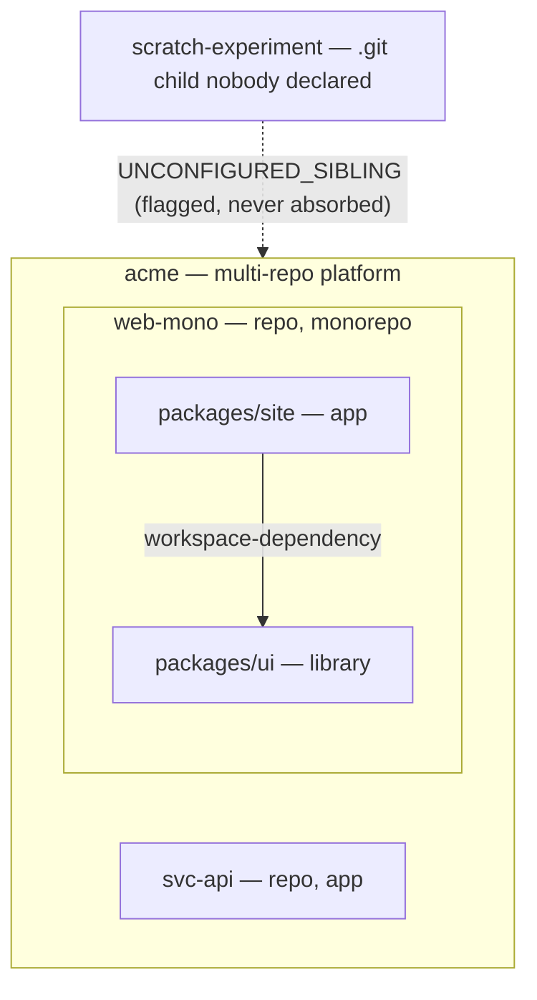

# @spec-engine/platform-map

A small, zero-runtime-dependency TypeScript library + CLI that answers one
question deterministically: **"What is this platform made of?"**

`platform-map` maps a platform of repos and monorepos into the services and
packages they represent, so human developers, teams, and agents all share
the same mental model of the platforms they maintain. A platform can be a
single repo, multiple repos, a monorepo, or a mix of single repos and
monorepos. Given any directory tree, `platform-map` produces one
deterministic, honest topology map (units + edges + diagnostics) — a
consistent way to map and connect otherwise non-relational repos, so teams
can make changes platform-wide instead of managing tickets and changes per
repo only. Dark Factory, Spec Engine, and Clarity Audit are its
first consumers, building on the same shared map.

The architecture's pillars — and which promises are verified vs. tracked gaps — live in [PRINCIPLES.md](./PRINCIPLES.md).

> **Status:** feature-complete for v1 — `detect()`, `map()`, `graph()`,
> `deriveRole()`, the adapters, the deterministic serializer, the CLI, and
> the platform-root convention (run-anywhere resolution) are all in place
> and verified. See [REQUIREMENTS.md](./REQUIREMENTS.md) for the
> requirement-by-requirement evidence.

## Install

```bash
npm install @spec-engine/platform-map
```

Zero runtime dependencies. Requires Node `>=20` or Bun.

## See it

Three unrelated repos — a plain service, a whole monorepo, and a stray
experiment — become one map:



The full visual walkthrough — real directory trees next to the real maps the
CLI produced from them, for every platform shape — is
[docs/demo.html](./docs/demo.html) (self-contained, open it in any browser).
To rebuild and verify all of it live on your machine:

```bash
npm run demo                            # builds fixtures, runs the CLI, 28 checked assertions
node scripts/demo-platform.mjs --keep   # same, but leaves the trees on disk to explore
```

The same flow runs inside the test suite (`test/demo.test.js`), so this page
and the demo can never silently drift from what the library actually does.

## Determinism

`toJSON(pm)` and `serialize(pm)` (exported from the package root) are the
single sort/stringify seam for a `PlatformMap`: the same logical map always
serializes to a byte-identical JSON string, regardless of the order its
`units`, `edges`, or `diagnostics` arrays were constructed in. Nested
`units[]` are sorted recursively by `name`; `edges` are sorted by
`(from, to)`; `diagnostics` are sorted by `(severity: error > warning > info,
then code, then path)`. All comparisons use plain `<`/`>` on strings — never
a locale-aware comparison — so output is stable across environments and Node
versions. Output never contains absolute filesystem paths or timestamps.

These two functions are an intentional additive extension beyond the
original design's function list: they give the dual ESM+CJS build a real
runtime export to validate (not just types), and are the seam every consumer
can rely on for byte-identical output.

## Diagnostics

Every diagnostic carries a `code`, a `severity` (`info` | `warning` |
`error`), an optional platform-relative `path`, and a human-readable
`message` with a stable prefix per code.

| Code | Meaning |
|------|---------|
| `UNCONFIGURED_SIBLING` | A candidate sibling repo has no config confirming it as a unit. |
| `CONFIG_CONFLICT` | Two sources disagree on a value; precedence was applied and both are reported. |
| `MALFORMED_CONFIG` | A JSON/shape error was found in a source file (adapter config, not canonical). |
| `UNMATCHED_PATTERN` | A workspace/ignore glob pattern matched nothing. |
| `CYCLE_SUSPECTED` | The edge graph contains a cycle; mapping still succeeds. |
| `UNIT_PATH_ESCAPE` | A resolved unit path would escape the platform root; the unit is dropped. |
| `CENSUS_TRUNCATED` | A depth or entry-count cap was hit during file census (additive code, not in the original design doc — added so bounded scans never truncate silently). |
| `PLATFORM_DRIFT` | A platform file disagrees with reality (additive code, RED-97): marker platform-name or root-hint mismatch, dangling marker, listed-but-missing member, dangling local override (all warnings), or a non-repo child dir at a platform root (info). Stable message prefix per sub-case. |

## Platform-root convention

Platform knowledge lives in files on disk, not in heads. Adoption is
progressive — three rungs, opt-in at every step:

1. **Single repo** — an in-repo `platform-map.json` (or nothing at all;
   detection works zero-config). Unchanged.
2. **Monorepo** — same file, same repo; workspace manifests supply the
   members. Unchanged.
3. **Multi-repo platform** — a small git repo (the *platform root*) holds the
   checked-in **canonical definition**; the member repos are its child
   directories (untracked by the platform repo's git). Running `platform-map`
   anywhere in the platform — the root, a member root, or any nested member
   subdir — yields the **same map, byte-identical**.

### The three file shapes

One filename, `platform-map.json`, three shapes discriminated by key
presence (checked in this order — `members` wins, then `platform`, else
today's unit-level config):

**Platform definition** — committed at the platform root. Identity only: the
platform name plus the member list. A member's `path` defaults to its `name`
(the child-dir convention) — omit it unless the member lives in a
subdirectory:

```json
{
  "name": "acme",
  "members": [
    { "name": "svc-api" },
    { "name": "svc-worker" },
    { "name": "webapp" }
  ],
  "ignore": ["scratch", "archive-*"]
}
```

(`platform`, `root`, `units`, and `overrides` are rejected alongside
`members` — a definition is identity, not configuration.)

**Member marker** — committed inside each member. Identity + root hint only,
no sibling lists, no machine paths:

```json
{
  "platform": "acme",
  "root": ".."
}
```

`root` defaults to `".."` and may be omitted. A member with a marker still
maps standalone as a plain repo when its platform root is missing — the
marker adds context, never a hard dependency.

**Unit-level config** — everything that worked before (rungs 1–2) keeps
working, byte-for-byte. A repo whose `platform-map.json` has neither
`members` nor `platform` self-describes exactly as today, and the upward
platform resolution deliberately stops at such a repo (the back-compat
firewall).

### Per-user disk locations: `platform-map.local.json`

The committed definition carries identity; **where members live on your
machine is per-user**. By default a member is expected at its conventional
child directory under the platform root. When your checkout lives elsewhere,
add `platform-map.local.json` next to the definition:

```json
{
  "locations": {
    "svc-worker": "../checkouts/svc-worker"
  }
}
```

Values are relative to the platform root (or absolute). **Add
`platform-map.local.json` to the platform repo's `.gitignore`** — it is
per-user machine state and must never be committed. An override changes only
where the member is *read* from disk: the unit's `path` in output stays the
conventional relative path, output is byte-identical with and without an
equivalent override, and machine paths never appear in output. A malformed
local file degrades to a `MALFORMED_CONFIG` warning — it can never brick the
map.

### Run-anywhere resolution and the boundary

`map()` resolves the platform root before detection: from the given
directory it walks upward, following a member marker's root hint or stopping
at a directory that holds a definition. The walk is bounded — it never
ascends above `MapOptions.boundary` (default `os.homedir()`), and marker
hints or local overrides that physically resolve outside the boundary
(symlinks included) become diagnostics (`UNIT_PATH_ESCAPE`, "escapes
resolution boundary") and are never followed. The boundary governs the
upward walk and marker/override following only: a definition at the invoked
directory itself is always honored — pointing `map()` (or the CLI) directly
at a platform root gets full rung-3 semantics even at `/tmp`, `/app`, or a
CI workspace outside `$HOME`. From INSIDE a member outside the boundary,
pass `--boundary <dir>` on the CLI (or `MapOptions.boundary`) to contain the
walk there.

At rung 3, member units always carry `sources: ["canonical"]` — a listed
member is a canonically declared identity regardless of physical presence or
local relocation. A listed member missing from disk is still emitted (with
empty signals) plus a `PLATFORM_DRIFT` warning; an unlisted `.git` child of
the platform root surfaces as `UNCONFIGURED_SIBLING`; membership is always
explicit, never guessed.

### Bootstrapping with `init`

`platform-map init` at a manifest-less directory whose children include git
repos proposes the full platform bootstrap:

```bash
$ platform-map init .          # or: init --yes to skip the prompt
{
  "platform-map.json": { "name": "acme", "members": [ ... ] },
  "svc-api/platform-map.json": { "platform": "acme", "root": ".." },
  "webapp/platform-map.json": { "platform": "acme", "root": ".." }
}
platform-map: will write 3 files:
  platform-map.json
  svc-api/platform-map.json
  webapp/platform-map.json
Write 3 files? [y/N]
```

The plan (stdout) is one JSON object keyed by root-relative file path; the
listing and prompt go to stderr. `init` never overwrites: if the root
`platform-map.json` exists the whole init refuses; if a member's file exists
that one file is skipped with a note and the rest are still written. It
never writes `platform-map.local.json` and never touches `.gitignore`.

## Detection flavor precedence

Workspace-manifest detection probes, in order: **pnpm-workspace.yaml** >
**yarn workspaces** > **npm workspaces** > **lerna.json**. `turbo.json`/
`nx.json` are recorded as an `orchestrator` overlay only — they never gate
which flavor is selected. This order is normative and ported deliberately
from prior art, not re-derived.

## License

MIT
