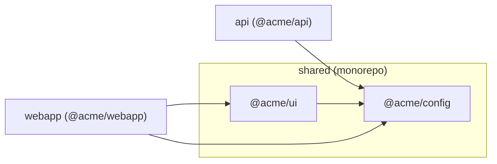

# @spec-engine/platform-map

Document which repositories make up a platform (a mobile app, an API, a web
app, a CLI, and the packages they share), discover the ones sitting next to
each other, and see what is inside every repo and monorepo, whether it is
Node, Python, Rust, or Go. Two small checked-in files, one convention, zero
dependencies.

## Getting started in 30 seconds

You have a folder with your platform's repos in it:

```
~/clients/acme/
  api/  webapp/  mobile/  shared/
```

See what platform-map sees, without writing anything:

```
$ cd ~/clients/acme
$ npx @spec-engine/platform-map
acme (multi-repo, undeclared)
├── api     single-repo  node  @acme/api  (no marker)
├── mobile  single-repo  node  acme-mobile  (no marker)
├── shared  monorepo     node  @acme/shared  (no marker)
│   ├── packages/config  @acme/config
│   └── packages/ui      @acme/ui
└── webapp  single-repo  node  @acme/webapp  (no marker)

info  UNDECLARED_PLATFORM  no platform-map.json here yet; run `platform-map init` to declare these 4 repositories as members of "acme"
```

Make it official:

```
$ npx @spec-engine/platform-map init --yes
```

That writes `platform-map.json` in the folder naming the four members, and a
one-line marker in each member. Commit them. From now on `platform-map` in
the folder or in any member prints the same map, and `platform-map check`
tells CI when the files and the disk disagree.

Prefer to confirm each repo? Drop `--yes` and it asks, one per line.

A directory counts as a repository if it has a `.git` entry or a
`package.json`. To keep one out (a scratch folder, say), pass
`--ignore scratch` to `init`; it is remembered in the platform file's
`ignore` list, so discovery and the unlisted-repo check skip it from then on.
You can also edit that list by hand.

## The two files

**Platform file**, committed in the platform repo:

```json
{ "name": "acme", "members": ["api", "mobile", "shared", "webapp"], "ignore": ["scratch"] }
```

**Leaf marker**, committed in each member repo:

```json
{ "platform": "acme", "member": "api" }
```

Both are named `platform-map.json`. Which one a file is depends on which key
it has. Neither contains a path: they say what is connected, not where
anything lives, so they are identical on every developer's machine.

## The convention

The platform repo is a small git repository whose job is to hold the platform
file. Members are its child directories, named after their member name:

```
acme/                   platform repo   (platform-map.json: name + members)
  api/                  member repo     (platform-map.json: platform + member)
  webapp/
  mobile/
  shared/               a monorepo member; its packages are listed in the map
```

Clone this way and nothing else is needed. `platform-map` in the platform
directory, in any member, or in any subdirectory of a member finds the same
platform.

## When your checkout does not follow the convention

Where repos live is per-developer, so it is never committed. One file per
machine records it:

`~/.config/platform-map/platforms.json`

```json
{
  "acme": {
    "root": "/Users/dev/clients/acme",
    "members": { "mobile": "/Users/dev/work/acme-mobile" }
  }
}
```

`root` says where the platform repo is. `members` lists only the members that
are not child directories of the root. `platform-map link` writes this file
for you:

```
$ cd ~/work/acme-mobile
$ platform-map link --root ~/clients/acme
```

Run without `--root` when the platform is already known on this machine.
From then on `platform-map` in that checkout reads its marker, looks the
platform up, and resolves every other member. Set `PLATFORM_MAP_CONFIG` or
pass `--config <file>` to use a different user file.

## What the map contains

```
$ platform-map
acme (multi-repo)
├── api     single-repo  node  @acme/api
├── mobile  single-repo  (not on this machine)
├── shared  monorepo     node  @acme/shared
│   ├── packages/config  @acme/config
│   └── packages/ui      @acme/ui
└── webapp  single-repo  node  @acme/webapp

warning  MEMBER_MISSING  member "mobile" is listed but not found on this machine (expected at mobile; run `platform-map link` in its checkout if it lives elsewhere)
```

Every directory is classified as one of three shapes:

| Shape | Recognized by |
|---|---|
| `multi-repo` | a platform file with `members` |
| `monorepo` | a workspace manifest from any supported ecosystem (the table below) |
| `single-repo` | anything else |

A member of a platform is classified the same way, so a member can be a
monorepo, and its packages appear under it. Each repo carries its
`ecosystem`, its `packageName`, and its `packageManager` (from its lockfile,
or the ecosystem's default) when they exist.

Each repo and package also carries `dependsOn`: the platform's own package
names it depends on, read from its manifest and matched within the same
ecosystem. That is how you answer "who uses `@acme/ui`?" across the whole
platform, not just inside one monorepo.

### Supported ecosystems

A repo's ecosystem is the one whose workspace manifest is present, else the
first in this order whose package manifest is. A repo with manifests from
two ecosystems and no workspace gets an `AMBIGUOUS_ECOSYSTEM` note. Every
manifest is read with a small built-in parser; a shape it does not
understand is a `MALFORMED_FILE` diagnostic, never a guess.

<!-- ecosystems:start -->
| Ecosystem | Package manifest | Workspace manifest | Package managers detected | What `dependsOn` reads |
|---|---|---|---|---|
| node | `package.json` | `pnpm-workspace.yaml`; `package.json` `workspaces` (yarn or npm); `lerna.json` | bun, npm, pnpm, yarn (from the lockfile) | `dependencies`, `devDependencies`, `peerDependencies` |
| python | `pyproject.toml` | `pyproject.toml` `[tool.uv.workspace]` `members` and `exclude` | pdm, poetry, uv (from the lockfile), else pip | `[project]` `dependencies` and `optional-dependencies`, `[dependency-groups]`; names compared case-insensitively with `-`, `_`, and `.` alike |
| rust | `Cargo.toml` | `Cargo.toml` `[workspace]` `members` and `exclude` | cargo | `[dependencies]`, `[dev-dependencies]`, `[build-dependencies]`, also per target; a renamed dependency counts under its `package` name |
| go | `go.mod` | `go.work` `use` lines | go | `require` lines (the module path is the package name) |
<!-- ecosystems:end -->

A platform can mix them. Each member is read with its own ecosystem's rules,
and `dependsOn` never crosses ecosystems, so a Python package named `core`
and a Go module named `core` stay apart:

```
poly (multi-repo)
├── go    monorepo     go
│   ├── api   example.com/acme/api
│   └── core  example.com/acme/core
├── py    monorepo     python  acme-py
│   ├── packages/api   acme-api
│   └── packages/core  acme_core
├── rs    monorepo     rust
│   ├── crates/api   acme-api
│   └── crates/core  acme-core
└── web   single-repo  node    web
```

### As JSON

`platform-map --json` prints the map as JSON. It is deterministic: the same
files and the same disk produce byte-identical output, from the platform
directory or from any member, and it never contains a machine path. Add
`--paths` to include where each repo is on this machine.

```json
{
  "name": "acme",
  "mode": "multi-repo",
  "declared": true,
  "repos": [
    {
      "name": "api",
      "mode": "single-repo",
      "ecosystem": "node",
      "packageName": "@acme/api",
      "dependsOn": ["@acme/config"],
      "packages": [],
      "present": true,
      "marker": "ok"
    },
    {
      "name": "shared",
      "mode": "monorepo",
      "ecosystem": "node",
      "packageName": "@acme/shared",
      "packageManager": "pnpm",
      "dependsOn": [],
      "packages": [
        { "path": "packages/config", "ecosystem": "node", "packageName": "@acme/config", "dependsOn": [] },
        { "path": "packages/ui", "ecosystem": "node", "packageName": "@acme/ui", "dependsOn": ["@acme/config"] }
      ],
      "present": true,
      "marker": "ok"
    }
  ],
  "diagnostics": [],
  "schemaVersion": 2
}
```

### As a diagram

`platform-map --mermaid` prints the map as a Mermaid flowchart: one node per
repo and package, one arrow per `dependsOn`. Paste it into a README or a
pull request.



## Diagnostics

| Code | Severity | Meaning |
|---|---|---|
| `MALFORMED_FILE` | error (warning for package and workspace manifests and the user file) | A file failed to parse or validate. |
| `MARKER_MISMATCH` | error | A member's marker names a different platform. |
| `MEMBER_MISSING` | warning | A listed member is not on this machine. |
| `MARKER_MISSING` | warning | A member has no marker. |
| `PLATFORM_NOT_LOCATED` | warning | A marker names a platform this machine cannot find. |
| `SCAN_TRUNCATED` | warning | A directory walk hit its depth or entry cap. |
| `UNLISTED_REPO` | info | A repository in the platform folder is not a member. |
| `UNDECLARED_PLATFORM` | info | A folder of repos with no platform file; the map is a preview. |
| `UNMATCHED_PATTERN` | info | A workspace glob matched no package. |
| `AMBIGUOUS_ECOSYSTEM` | info | A repo has manifests from more than one ecosystem; the first in table order is reported. |

`platform-map check` exits 1 when any error or warning is present. Info never
fails a check.

## CLI

```
platform-map [dir]              print the map (tree)
platform-map --json [dir]       print the map as deterministic JSON
platform-map --mermaid [dir]    print the map as a Mermaid flowchart
platform-map --paths [dir]      include where each repo is on this machine
platform-map init [dir]         discover repos here and declare them as members
platform-map link [dir]         record where this checkout lives
platform-map check [dir]        exit 1 if the files and the disk disagree

--yes, -y          answer yes to every prompt
--dry-run          init: print the plan, write nothing
--root <dir>       link: where the platform directory is
--config <file>    per-user file (default: $PLATFORM_MAP_CONFIG or ~/.config/platform-map/platforms.json)
--ignore <name>    skip a directory during discovery (repeatable; init remembers it in the platform file)
```

`dir` defaults to the current directory. The tree goes to stdout and
diagnostics to stderr; `--json` output is always clean. Exit codes: 0, or 1
on a usage error, a missing directory, an error-severity diagnostic, or a
failed `check`. `init` and `link` refuse to write without a terminal unless
`--yes` is passed. `init` never overwrites an existing marker.

## Library

The CLI is a thin wrapper. Every command is a synchronous function that reads
files and directories only; nothing runs a subprocess or touches the network.

```js
import { map, toJSON, toMermaid, check } from "@spec-engine/platform-map";

const pm = map("/Users/dev/clients/acme");   // PlatformMap
toJSON(pm);                                  // the deterministic JSON string
toMermaid(pm);                               // the flowchart
check("/Users/dev/clients/acme").ok;         // true when nothing is wrong
```

| Function | Returns |
|---|---|
| `map(dir, options?)` | `PlatformMap`: the map described above. Throws only `DirectoryNotFoundError`. |
| `check(dir, options?)` | `{ ok, problems }`: the error and warning diagnostics. |
| `locate(dir, options?)` | `Locations`: absolute paths of the platform root and every present member. |
| `detect(dir)` | `Detection`: `single-repo`, `monorepo` (with the manifest kind, its ecosystem, and globs), or `multi-repo`. |
| `discover(dir, options?)` | `Candidate[]`: child directories with a `.git` entry or a `package.json`. |
| `planInit(dir, options?)` / `applyInit(plan, include)` | What `init` would write, then write it for the confirmed names. |
| `planLink(dir, options?)` / `applyLink(plan)` | What `link` would record, then record it. |
| `render(map, locations?)`, `toJSON(map)`, `toMermaid(map)`, `formatDiagnostics(map)` | The three outputs, plus the diagnostics block. |

`options.userConfigPath` overrides the user file; `options.ignore` adds
directory names to skip. Every type is exported. ESM and CommonJS.

## Install

```
npm install @spec-engine/platform-map
```

Node 24 or newer, or Bun. Zero runtime dependencies.

## Contributing

```
npm ci
npm run build        # dist/ (tsdown)
npm test             # node --test over src/**/*.test.ts and bin/**/*.test.ts
npm run test:bun     # the same package under Bun
npm run lint         # biome
npm run lint:docs    # no private jargon in public files
npm run lint:tests   # every test sits next to the file it tests
npm run typecheck    # tsc
npm run docs:ecosystems   # regenerate the Supported ecosystems table in this README
```

Every test lives next to the file it tests and is named after it
(`src/map.test.ts` tests `src/map.ts`; `bin/platform-map.test.ts` drives the
built CLI end to end). `test/` holds only shared fixtures and helpers;
`npm run lint:tests` enforces this. The design
notes are in
[docs/spec.md](https://github.com/spec-engine/platform-map/blob/main/docs/spec.md);
the pipeline is drawn in
[docs/architecture.md](https://github.com/spec-engine/platform-map/blob/main/docs/architecture.md).

## License

MIT
