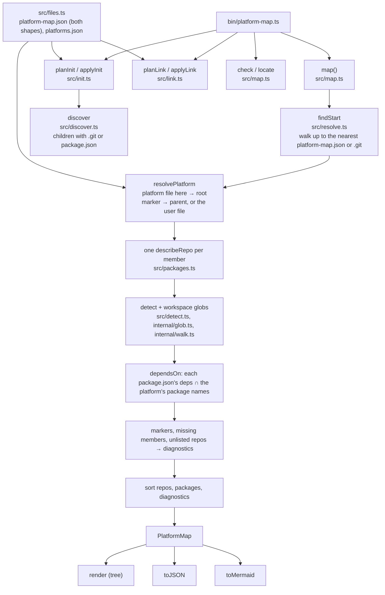

# Architecture

Everything is a plain function over the filesystem. The CLI in
`bin/platform-map.ts` parses arguments, calls one function, prints, and sets
the exit code.

## Files

| File | Job |
|---|---|
| `src/types.ts` | The public types. |
| `src/files.ts` | Read and validate the platform file, the leaf marker, and the per-user file. Write them. |
| `src/detect.ts` | `single-repo` / `monorepo` / `multi-repo` for one directory; which workspace manifest. |
| `src/discover.ts` | Child directories that look like repositories. |
| `src/packages.ts` | Facts about one repo: package name, package manager, workspace packages, declared deps. |
| `src/resolve.ts` | Find the platform root from wherever the command ran. |
| `src/map.ts` | `map`, `locate`, `check`. |
| `src/init.ts`, `src/link.ts` | The two writing commands, each split into a plan and an apply. |
| `src/render.ts` | Tree, JSON, Mermaid. |
| `src/internal/` | The glob matcher, the bounded directory walk, and the pnpm YAML subset. |

## Rules that hold everywhere

- Nothing throws except `DirectoryNotFoundError`. A broken file is a diagnostic.
- `map` output never contains an absolute path, and every array is sorted with
  plain string comparison. Same files and same disk give the same bytes.
- Symlinks are never followed. Directory walks are capped and say so when
  they stop early.
- Only `applyInit` and `applyLink` write, and only what their plan lists.
  `applyInit` never overwrites a marker.
