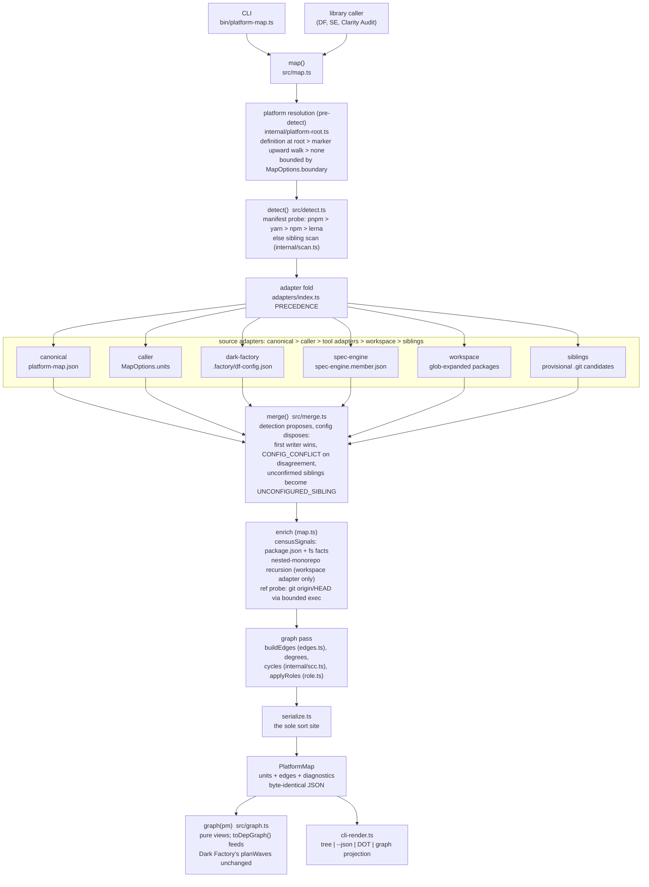
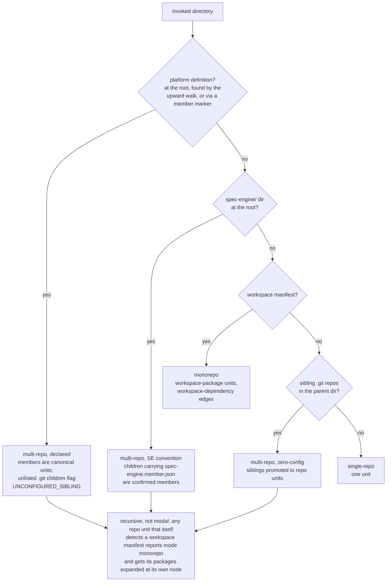

# Architecture

platform-map owns three concerns (BRIEF §3): **detect** (what shape is this
place), **enumerate** (normalize every config surface into one unit model),
and **graph** (dependency edges and views over them). Everything else is a
door onto the same engine: library API, CLI, someday MCP.

The engine is a pipeline of pure stages around one impure edge. Source
adapters read config surfaces; a precedence fold reconciles them (detection
proposes, config disposes); one serialize seam makes output byte-identical.
Exactly two errors escape `map()`: nonexistent root and malformed canonical
config. Every other failure becomes a diagnostic in the map itself.

## The map() pipeline

Signals are facts; `role` is a derived view any consumer can recompute via
the exported `deriveRole()`, and canonical `overrides` beat derivation.
Tool semantics (DF pointer resolution, SE pins, wave planning) stay in the
tools; adapters carry only linkage signals.

Primitives under `src/internal/`: `walk` (bounded, symlink-safe), `glob`
(ReDoS-safe subset), `yaml-subset` (pnpm `packages:` only), `path-guard`
(escape checks), `exec`/`ref-probe` (the one subprocess), `df-pointer` (the
DF pointer-only predicate, shared by the scan and two adapters), `scc`
(Tarjan, shared by the CYCLE_SUSPECTED diagnostic and `graph().cycles()`).

## How each platform shape is reached

Two invariants hold on every path: absence of a signal is never asserted as
false, and every dropped or ambiguous thing becomes a diagnostic, never a
silent skip.
