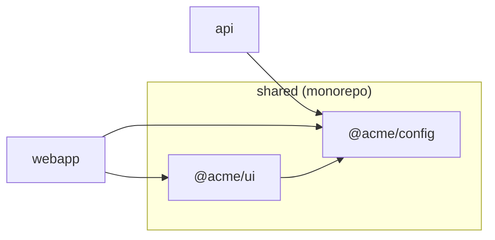

# platform-map 0.4 — design notes

The agreed design, kept as the reference for what the code does and why. Three parts: the public documentation as it would appear
in the README, the types, and the commands as library functions. The CLI is a
thin wrapper over the commands and is described last, as a table.

---

## Part 1 — Documentation (README draft)

### What it is

`platform-map` documents that several repositories belong to one platform (a
mobile app, an API, a web app, a CLI, and the packages they share), and shows
what each of those repositories contains. It works from two small checked-in
files and one convention, and it tells you when the files and the disk
disagree.

It answers three questions from any directory:

1. **Is this a single repo, a monorepo, or a multi-repo platform?**
2. **What is in it?** For a platform: the member repos. For a monorepo: its
   packages. For a platform whose members are monorepos: both.
3. **Does the declaration match reality?** Members missing from disk, repos in
   the folder nobody declared, markers pointing at the wrong platform.

### Getting started in 30 seconds

You have a folder with your platform's repos in it:

```
~/clients/acme/
  api/  webapp/  mobile/  shared/
```

See what platform-map sees, without writing anything:

```
$ cd ~/clients/acme
$ npx @spec-engine/platform-map
acme (multi-repo, undeclared)
├── api        single-repo   @acme/api
├── webapp     single-repo   @acme/webapp
├── mobile     single-repo   acme-mobile
└── shared     monorepo
    ├── packages/ui       @acme/ui
    └── packages/config   @acme/config

info  UNDECLARED_PLATFORM  no platform-map.json here yet; run `platform-map init` to declare these members
```

Make it official:

```
$ npx @spec-engine/platform-map init --yes
```

That writes `platform-map.json` in the folder naming the four members, and a
one-line marker in each member. Commit them. From now on `platform-map` in
the folder or in any member prints the same map, and `platform-map check`
tells CI when the files and the disk disagree.

Prefer to confirm each repo? Drop `--yes` and it asks, one per line.

### The two files

**Platform file**, committed in the platform repo:

```json
{ "name": "acme", "members": ["api", "webapp", "mobile", "shared"] }
```

**Leaf marker**, committed in each member repo:

```json
{ "platform": "acme", "member": "api" }
```

Both are named `platform-map.json`. Which one a file is depends on which key
it has. Neither contains a path: they say what is connected, not where
anything lives, so they are identical on every developer's machine.

### The convention

The platform repo is a small git repository whose job is to hold the platform
file. Members are its child directories, named after their member name:

```
acme/                   platform repo   (platform-map.json: name + members)
  api/                  member repo     (platform-map.json: platform: acme)
  webapp/
  mobile/
  shared/               a monorepo member; its packages are listed in the map
```

Clone this way and nothing else is needed. `platform-map` in the platform
directory or in any member finds the same platform.

### When your checkout does not follow the convention

Where repos live is per-developer, so it is never committed. One file per
machine records it:

`~/.config/platform-map/platforms.json`

```json
{
  "acme": {
    "root": "/Users/dev/clients/acme",
    "members": { "mobile": "/Users/dev/work/acme-mobile" }
  }
}
```

`root` says where the platform repo is. `members` lists only the members that
are not child directories of the root. `platform-map link` writes this file
for you; you never edit it by hand unless you want to.

From a member cloned anywhere, `platform-map` reads the marker, looks the
platform up here, and resolves every other member.

### Setting a platform up: `init`

Run it in a folder that holds your repos:

```
$ platform-map init
Found 5 repositories in /Users/dev/clients/acme:
  api       (git)
  webapp    (git)
  mobile    (git)
  shared    (git, monorepo: 3 packages)
  scratch   (package.json only)
Include api in acme? [Y/n]
...
Will write:
  platform-map.json
  api/platform-map.json
  webapp/platform-map.json
  mobile/platform-map.json
  shared/platform-map.json
Proceed? [y/N]
```

A directory counts as a repository if it has a `.git` entry or a
`package.json`. Running `init` again in an existing platform only asks about
repositories that are not yet listed. It never overwrites a marker that
already exists. `init --dry-run` prints the plan and writes nothing.

Membership is only ever what `init` confirmed. A repository sitting in the
folder that nobody confirmed shows up as `UNLISTED_REPO`, never as a member.

### Connecting a checkout that lives elsewhere: `link`

```
$ cd ~/work/acme-mobile
$ platform-map link --root ~/clients/acme
Linked mobile -> /Users/dev/work/acme-mobile (platform acme at /Users/dev/clients/acme)
```

Run without `--root` when the platform is already known on this machine.

### Reading the map

```
$ platform-map
acme (multi-repo)
├── api        single-repo   @acme/api
├── webapp     single-repo   @acme/webapp
├── mobile     single-repo   acme-mobile        (not on this machine)
└── shared     monorepo
    ├── packages/ui       @acme/ui
    ├── packages/config   @acme/config
    └── packages/types    @acme/types

warning  MEMBER_MISSING  mobile: listed but not found (run `platform-map link` in its checkout)
info     UNLISTED_REPO   scratch: repository in the platform folder, not a member
```

`--json` prints the map as JSON. The JSON is deterministic: same files and
same disk in, byte-identical output out, and it never contains a machine
path. Add `--paths` to include where each repo is on this machine.

Each repo and package carries `dependsOn`: the platform's own package names
it depends on, read from its package.json. That is how you answer "who uses
`@acme/ui`?" across the whole platform, not just inside one monorepo.

### Seeing it as a diagram

```
$ platform-map --mermaid
```

Prints the map as a Mermaid flowchart: one subgraph per repo, one node per
package, an arrow for every `dependsOn`. Paste it into a README, a pull
request, or anything that renders Mermaid. Same facts as the tree, different
picture.



### Checking in CI

```
$ platform-map check
```

Exits 0 when every listed member is present with a correct marker and no
file is malformed; exits 1 otherwise, printing the problems. Unlisted
repositories are reported but do not fail the check.

### Install

```
npm install @spec-engine/platform-map
```

Zero runtime dependencies. Node 24 or newer, or Bun. ESM and CommonJS.

---

## Part 2 — Types

Everything below is exported. These types are the API; changing a shape is a
breaking change.

```ts
// ── The map ─────────────────────────────────────────────────────────────

export type Mode = "single-repo" | "monorepo" | "multi-repo";

export interface PlatformMap {
  /** Platform name from the platform file; otherwise the directory name. */
  name: string;
  mode: Mode;
  /** False when the map was built from discovery alone (a folder of repos
   *  with no platform file yet). Such a map is a preview: nothing in it is a
   *  member until `init` writes the files. */
  declared: boolean;
  /** One entry for a single repo or monorepo; one per member for a platform.
   *  Sorted by name. */
  repos: Repo[];
  /** Sorted by severity (error, warning, info), then code, then subject. */
  diagnostics: Diagnostic[];
  schemaVersion: 2;
}

export interface Repo {
  /** Member name from the platform file, or the directory name. */
  name: string;
  mode: "single-repo" | "monorepo";
  /** The "name" field of the repo's package.json, when it has one. */
  packageName?: string;
  /** From the lockfile or package.json "packageManager" field, when determinable. */
  packageManager?: "npm" | "pnpm" | "yarn" | "bun";
  /** Package names from this platform that the repo's own package.json
   *  depends on (dependencies, devDependencies, peerDependencies). Sorted. */
  dependsOn: string[];
  /** The workspace packages of a monorepo; empty for a single repo. Sorted by path. */
  packages: Package[];
  /** Whether the repo was found on this machine. When false, mode is
   *  "single-repo", packages is empty, and marker is "unknown". */
  present: boolean;
  /** State of the leaf marker inside the repo. */
  marker: "ok" | "missing" | "mismatch" | "unknown";
}

export interface Package {
  /** Path relative to the repo root, e.g. "packages/ui". */
  path: string;
  /** The "name" field of the package's package.json, when it has one. */
  packageName?: string;
  /** Package names from this platform that this package depends on. Sorted. */
  dependsOn: string[];
}

// ── Diagnostics ─────────────────────────────────────────────────────────

export type DiagnosticCode =
  | "MALFORMED_FILE"        // a platform-map.json or the user file failed to parse or validate
  | "MEMBER_MISSING"        // listed in the platform file, not found on this machine
  | "MARKER_MISSING"        // member has no platform-map.json marker
  | "MARKER_MISMATCH"       // member's marker names a different platform
  | "UNLISTED_REPO"         // a repository in the platform folder is not a member
  | "PLATFORM_NOT_LOCATED"  // marker names a platform this machine cannot find
  | "UNDECLARED_PLATFORM"   // folder of repos with no platform file; map is a preview
  | "UNMATCHED_PATTERN";    // a workspace glob matched no package

export interface Diagnostic {
  code: DiagnosticCode;
  severity: "error" | "warning" | "info";
  /** What the diagnostic is about: a member name, a package path, or a filename. */
  subject: string;
  message: string;
}

// ── Detection (what shape is this directory) ────────────────────────────

export interface Detection {
  mode: Mode;
  /** Present when mode is "monorepo": which manifest declared the packages. */
  manifest?: "pnpm-workspace" | "yarn-workspaces" | "npm-workspaces" | "lerna";
  /** Present when mode is "monorepo": the raw globs from that manifest. */
  workspaceGlobs?: string[];
}

// ── Discovery (what is in this folder) ──────────────────────────────────

export interface Candidate {
  /** Directory name. */
  name: string;
  hasGit: boolean;
  hasPackageJson: boolean;
  /** Present when the directory holds a leaf marker: the platform it names. */
  marker?: string;
  /** True when a platform file in this folder already lists it. */
  listed: boolean;
}

// ── Locations (this machine only; never part of the map) ────────────────

export interface Locations {
  /** Absolute path of the platform repo, or of the lone repo. */
  root: string;
  /** Member name -> absolute path. Missing members are absent. */
  repos: Record<string, string>;
  /** Which entries came from the user file rather than the convention. */
  overridden: string[];
}

// ── Plans (what a writing command would do; nothing is written) ─────────

export interface InitPlan {
  root: string;
  platformName: string;
  /** Every discovered candidate, with whether it is already a member. */
  candidates: Candidate[];
  /** Files that would be written if every unlisted candidate is included,
   *  as root-relative path -> file content. Recomputed by applyInit for the
   *  confirmed subset. */
  writes: Record<string, PlatformFile | LeafMarker>;
  /** Root-relative paths that already exist and would be left alone. */
  skipped: string[];
}

export interface LinkPlan {
  platformName: string;
  root: string;
  /** Member name -> absolute path to record. Empty when the checkout already
   *  follows the convention. */
  members: Record<string, string>;
  userFile: string;
}

export interface WriteResult {
  /** Absolute paths written. */
  written: string[];
  /** Absolute paths deliberately not written (already existed). */
  skipped: string[];
}

// ── The committed files ─────────────────────────────────────────────────

export interface PlatformFile {
  name: string;
  members: string[];
  /** Directory names to ignore during discovery. Optional. */
  ignore?: string[];
}

export interface LeafMarker {
  platform: string;
  /** The member name this repo is listed under; lets a checkout that lives
   *  elsewhere identify itself. Written by init. */
  member?: string;
}

// ── The per-user file ───────────────────────────────────────────────────

export type UserConfig = Record<
  string, // platform name
  { root: string; members?: Record<string, string> }
>;

// ── Options shared by every command ─────────────────────────────────────

export interface Options {
  /** Path of the per-user file. Default: $PLATFORM_MAP_CONFIG, else
   *  ~/.config/platform-map/platforms.json. Tests pass a temp path. */
  userConfigPath?: string;
  /** Extra directory names to ignore during discovery. Merged with the
   *  platform file's `ignore`. Default: none beyond node_modules and dotdirs. */
  ignore?: string[];
}

// ── The one error ───────────────────────────────────────────────────────

/** Thrown when the directory given to a command does not exist. Every other
 *  problem is a diagnostic. */
export class DirectoryNotFoundError extends Error {}
```

---

## Part 3 — Commands

Each command is a plain exported function. All are synchronous: the package
reads files and directories only, never runs a subprocess, and never
touches the network. The only things that write to disk are `applyInit` and
`applyLink`, and each writes only what its plan lists.

### `detect(dir, options?): Detection`

Classifies one directory. Rules, first match wins:

1. `platform-map.json` with `members` → `multi-repo`.
2. A workspace manifest → `monorepo`. Probe order: `pnpm-workspace.yaml`,
   `package.json` `workspaces` (yarn or npm, told apart by `yarn.lock`),
   `lerna.json`.
3. Otherwise → `single-repo`.

Reads at most four files. Never throws except `DirectoryNotFoundError`.

### `discover(dir, options?): Candidate[]`

Lists the child directories of `dir` that look like repositories: a `.git`
entry (directory or file) or a `package.json`. Skips `node_modules`,
dot-directories, and anything in `ignore`. Reads each candidate's marker if
present and notes whether the platform file in `dir` (if any) lists it.
Sorted by name.

### `map(dir, options?): PlatformMap`

The main read. Steps:

1. **Find the starting directory.** From `dir`, walk upward to the nearest
   directory that holds a `platform-map.json` or a `.git` entry, stopping at
   `$HOME` or the filesystem root. Symlinks are not followed. This is what
   lets `platform-map` work from `api/src/foo`. If nothing is found, the
   starting directory is `dir` itself.
2. **Find the platform root.**
   - The starting directory holds a platform file → that is the root.
   - It holds a marker naming `X` → if the parent holds a platform file
     named `X`, root is the parent; else if the user file knows `X`, root is
     its recorded path; else the result is a `single-repo` map for the
     directory with a `PLATFORM_NOT_LOCATED` warning.
   - Neither, and `discover` finds two or more repositories among its
     children → a **preview** map: `mode: "multi-repo"`, `declared: false`,
     one `Repo` per candidate with `marker: "missing"`, plus one
     `UNDECLARED_PLATFORM` info. Nothing is written.
   - Neither, otherwise → a lone repo. `detect` it, list its packages if it
     is a monorepo, return a map with one `Repo`.
3. **Resolve members.** For each name in the platform file: the user file's
   override if present, else `<root>/<name>`. Missing on disk →
   `present: false` and `MEMBER_MISSING` (warning).
4. **Describe each present member.** `detect` it; if monorepo, expand its
   workspace globs into `packages` (bounded walk, no symlink following,
   `UNMATCHED_PATTERN` info for a glob that matched nothing). Read
   `packageName` and `packageManager`. Read its marker: absent →
   `MARKER_MISSING` (warning); different name → `MARKER_MISMATCH` (error).
5. **Compute `dependsOn`.** Collect every `packageName` in the map. For each
   repo and package, `dependsOn` is the intersection of that set with the
   names in its package.json `dependencies`, `devDependencies`, and
   `peerDependencies`. Cross-repo by construction.
6. **Report strays.** `discover(root)` candidates that are not members →
   `UNLISTED_REPO` (info).
7. **Sort everything.** Repos by name, packages by path, `dependsOn` and
   diagnostics likewise. Plain string comparison, never locale.

The result never contains an absolute path. Same files and same disk produce
byte-identical JSON via `toJSON`.

### `locate(dir, options?): Locations`

The per-machine companion to `map`. Same root resolution, then the absolute
directory of every present member, noting which came from the user file.
This is what `--paths` merges into the CLI output. Never part of `map`'s
result, so `map` stays deterministic.

### `check(dir, options?): { ok: boolean; problems: Diagnostic[] }`

`map(dir)` filtered to diagnostics of severity `error` or `warning`.
`ok` is true when there are none. `UNLISTED_REPO` and `UNMATCHED_PATTERN` are
info and never fail a check.

### `planInit(dir, options?): InitPlan`

Decides what `init` would do, without writing:

- No platform file in `dir`: proposes one named after the directory, lists
  every candidate from `discover(dir)` as a member, and proposes a marker for
  each.
- Platform file already there: keeps its name and members, proposes only the
  unlisted candidates, and proposes markers for listed members that lack one.
- Any candidate whose marker names a different platform is included in
  `candidates` with that name set so the caller can warn; it is not proposed.

Existing files are never in `writes`; they are in `skipped`.

### `applyInit(plan, include, options?): WriteResult`

`include` is the subset of candidate names the user confirmed. Writes the
platform file (creating or updating `members`) and one marker per included
candidate. Never overwrites an existing marker. Returns exactly what was
written.

### `planLink(dir, options?): LinkPlan`

For a member checkout: reads the marker to learn the platform name; finds the
root from `options.root`, the parent directory, or the user file (in that
order); records `dir` as the member's location when it is not `<root>/<name>`.
For a platform directory: records only `root`. Throws nothing; a directory
with neither file yields a plan with an empty `members` and a
`PLATFORM_NOT_LOCATED`-style message the caller can show.

### `applyLink(plan, options?): WriteResult`

Creates or updates the user file with the plan's `root` and `members` for that
platform. Other platforms in the file are untouched. Creates the parent
directory if needed.

### `toJSON(map): string`

The single serializer: stable key order, sorted arrays, two-space indent,
trailing newline. `--json` prints exactly this.

### `render(map, locations?): string`

The human tree shown in Part 1. Pure. Takes `locations` only when `--paths`
was asked for.

### `toMermaid(map): string`

The Mermaid flowchart shown in Part 1: a subgraph per monorepo repo, a node
per repo and package labelled with its `packageName` (or name), and one arrow
per `dependsOn` entry. Pure and deterministic, so the same map always yields
the same diagram text. This replaces the old graph API: the picture is the
outcome, and any tool that wants the graph as data reads `dependsOn`.

---

## Part 4 — CLI (a wrapper, nothing more)

| Command | Calls | Prints | Exit |
|---|---|---|---|
| `platform-map [dir]` | `map`, `render` | tree to stdout, diagnostics to stderr | 0; 1 if any `error` diagnostic |
| `platform-map --json [dir]` | `map`, `toJSON` | JSON to stdout, nothing on stderr | same |
| `platform-map --paths [dir]` | `map`, `locate` | tree or JSON with a `paths` section | same |
| `platform-map --mermaid [dir]` | `map`, `toMermaid` | Mermaid flowchart to stdout | same |
| `platform-map init --dry-run [dir]` | `planInit` | the plan, nothing written | 0 |
| `platform-map check [dir]` | `check` | problems to stderr | 0 if ok, else 1 |
| `platform-map init [dir] [--yes]` | `planInit`, prompt per candidate, `applyInit` | plan and prompts to stderr; written paths to stdout | 0; 1 on refusal or write error |
| `platform-map link [dir] [--root <path>]` | `planLink`, confirm, `applyLink` | what was recorded | 0; 1 if the platform cannot be located |
| `platform-map --help`, `--version` | | | 0 |

Global flags: `--config <file>` (sets `userConfigPath`), `--ignore <name>`
(repeatable), `--yes` (skip prompts). A nonexistent `dir` is exit 1 with one
line on stderr. Prompts go to stderr so `--json` output is always clean.

---

## Part 5 — What this removes from 0.3

The edge objects and the graph API (`dependsOn` facts and the Mermaid
rendering take their place), cycle detection, signals and role derivation
(`packageName` and `packageManager` stay as plain facts), the Dark Factory
and Spec Engine adapters and the Spec Engine folder convention, silent
sibling promotion (the preview map plus `init` take its place), marker root
hints, the `$HOME` containment machinery around them (a plain upward walk to
the repo root stays), per-platform `platform-map.local.json`, DOT output, the
git default-branch probe (so no subprocess and no timeouts), and the `ref`
field. `map` becomes synchronous.

Open question for you: `schemaVersion` bumps to 2 because the shape changed.
Version 0.4.0 on npm.
